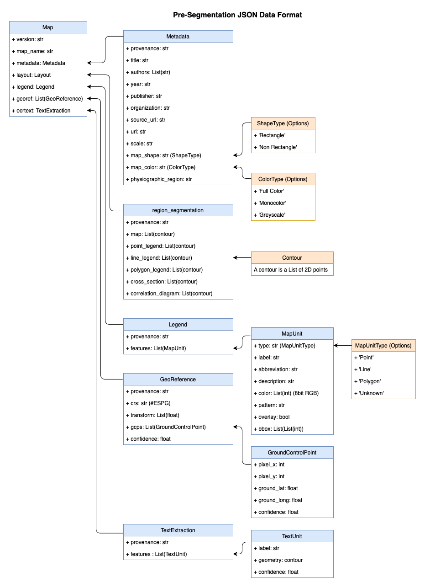

# CMAAS_UTILS

This package contains common utility functions including structured data classes, io functions and other utilities that are used across the TA1 teams for DARPA Critical Mineral Assesments with AI Support (CMAAS)

[](https://github.com/abodeuis/cmaas_utils/actions/workflows/testrunner.yml)
[](https://test.pypi.org/project/cmaas-utils/)


## Installation
The inital distribution of CMAAS_Utils is listed on test pypi and be install with `pip` or your favorite PyPI package manager.

```bash
pip install -i https://test.pypi.org/simple/ cmaas-utils
```

## Examples 

## Documentation
The io portion of this package is intended to provide the reading and writing functions for transfering data between the ta1 teams. 

Format is designed to be modular and allow for non-destructive merging of files. 


## Description of Pre-Segmentation Format
#### Map
* **version** :<br>
    The version of the pre-segmentation format that the file is compling with.
* **map_name** :<br>
    The name of the map that the pre-segmentation data is associated with. *Need to come to concensus on how to name maps. Is it the prod_desc, is it a text name?
* **metadata** :<br>
    Section containing the metdata fields of the map
* **layout** :<br>
    Section containing the segmentation of regions of the map, E.g. Where is the map, where is the legend.
* **legend** :<br>
    Section containing details about the individual map units of the legend. 
* **georef** :<br>
    Section containing the predicted georeferences for the map
* **ocrtext** :<br>
    Section containing information about individual pieces of text on the map.

#### Metadata
* **provenance** : str<br>
    The origin source for this data. E.g. What team produced this data. 
* **title** : str<br>
    The title of the map
* **authors** : List(str)<br>
    The author(s) of the map
* **year** : str<br>
    The year the map was released
* **publisher** : str<br>
    The organization that published the map 
* **organization** : str<br>
    The organization that created the map
* **source_url** : str<br>
    The publisher url that the map orginal was taken from
* **url** : str<br>
    The url that we use? CDR?
* **scale** : str<br>
    The scale the map is in. E.g. 1:24000
* **map_shape** : str<br>
    The shape of the map region, Is it a regular rectanglur map or a non-rectangler map region.
* **map_color** : str<br>
    The color scheme of the map. This can be Full Color, Monocolor, or Greyscale.
* **physiographic_region** : str<br>
    The physiographic region that the map comes from, this needs a list of definitions still.
  
#### Layout
* **provenance** : str<br>
    The origin source for this data. E.g. What team produced this data. 
* **map** : List(Contour)<br>
    The bounding contour for the area of the image the map is in. *Note: can potentionally be multiple disconnected contours as well.
* **point_legend** : List(Contour)<br>
    The bounding contour for the area the point units of the legend are in. *Note: can potentionally be multiple disconnected contours as well.
* **line_legend** : List(Contour)<br>
    The bounding contour for the area the line units of the legend are in. *Note: can potentionally be multiple disconnected contours as well.
* **polygon_legend** : List(Contour)<br>
    The bounding contour for the area the polygon units of the legend are in. *Note: can potentionally be multiple disconnected contours as well.
* **cross_section** : List(Contour)<br>
    The bounding contour for the area of the image the cross section is in. *Note: can potentionally be multiple disconnected contours as well.
* **correlation_diagram** : List(Contour)<br>
    The bounding contour for the area of the image the correlation diagram is in. *Note: can potentionally be multiple disconnected contours as well.
    
  

#### Legend
* **provenance** : str<br>
    The origin source for this data. E.g. What team produced this data. 
* **features** : list(MapUnit)<br>
    The list of map units for this legend.

#### MapUnit
* **type** : str<br>
    The type of feature the map unit is. Possible values are 'Point', 'Line', 'Polygon' or 'Unknown'.
* **label** : str<br>
    The full name of a map unit.
* **abbreviation** : str<br>
    The short abbreviation of a map units label, for polygons this is often a 3-4 letter code. 
* **description** : str<br>
    The corrasponding description for a map unit label in the legend.
* **color** : str<br>
    The hex code of the median color of a map units label. If a map unit is patterned this does not mean anything.
* **pattern** : bool<br>
    boolean value which indicates weather a polygon label is a patterned label E.g. Not a solid color label
* **overlay** : bool<br>
    Boolean value that indicates wheather a polygon label is an overlay E.g. a map unit that can appear on top of other polygon map units.
* **bbox** : Contour<br>
    The set of xy coordinates that define the bounding box for a map unit.

#### Georeference
* **provenance** : str<br>
    The origin source for this data. E.g. What team produced this data. 
* **crs** : str<br>
    The EPSG number for the crs. Should be in the format "EPSG:####" or an equivelent that can be read by rasterio.CRS.from_string()
* **transform** : List(float)<br>
    float components of a affine transform. Should be in the format that can be read by rasterio.transforms.affine
* **gcps** : List(GroundControlPoint)<br>
    A List of of ground control points that can be used to create the transform and crs.
* **confidence** : float<br>
    The model's confidence score for this georeference.

#### GroundControlPoint
* **pixel_x** : int <br>
    The x coordinate of the pixel being used for the gcp
* **pixel_y** : int <br>
    The y coordinate of the pixel being used for the gcp
* **ground_lat** : float <br>
    The lattatude of the point being used for the gcp
* **ground_long** : float <br>
    The longuitude of the point being used for the gcp
* **confidence** : float<br>
    The model's confidence score for this gcp.

#### OCRText
* **provenance** : str<br>
    The origin source for this data. E.g. What team produced this data. 
* **features** : list(TextUnit)<br>
    The list of text units for this legend.
  
#### TextUnit
* **label** : str <br>
    The text contained in this unit.
* **geometry** : contour <br>
    The bounding contour of this unit
* **confidence** : float<br>
    The model's confidence score for this unit.

## Contributing
You can run pytest coverage report to see what needs tests written still.
```bash
pytest --cov-report html --cov=src/cmaas_utils tests 
```


### License

Software is licensed under the MIT License<br>
See LICENSE for more information
